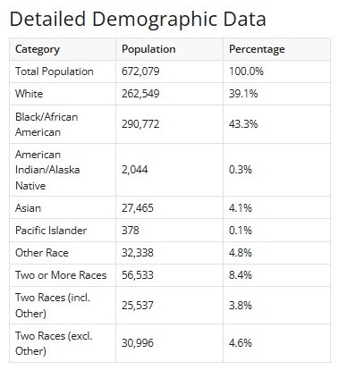

```{r setup, include=FALSE}
knitr::opts_chunk$set(echo = TRUE)
#install.packages("pak")
#install.packages("posterdown")
pak::pak('rstudio/pagedown')
library(readr)
library(dplyr)
library(tidyverse)
library(ggplot2)
library(here)
here::i_am("poster-template.Rmd")
```

```{r, eval=F, include=FALSE}
# do not remove; this line is to create the PDF version of your poster
# update.packages(c("pagedown", "servr"))

pagedown::chrome_print("poster-template.Rmd")
```

# Overview

We report on the development of an interactive, open source dashboard to explore research on a *Patchwork Nation* (Gimpel & Schuknecht, 2003). A system to support internal user needs is considered to prioritize knowledge of "parallel changes" in the Patchwork Nation model. System was balanced to provide efficient access to changes in individual demographic trends in U.S. states from 2009 to 2023. Using the U.S. Census Bureau's American Community Survey (ACS) estimates, we evaluated population distribution, growth rates, and diversity trends in large urban centers and rural areas with a focus on racial and ethnic categorizations. Preliminary findings reveal that urban areas exhibit greater changes in racial categorization compared to rural areas.

This work is part of a larger mapping project focused on identifying the multiple dimensions that may constitute what we mean by communities and neighborhoods. Race and ethnicity play a major role in how we define geographical areas. As a result, some efficient tools are needed to support quick inquiries related to how a state or more local geographic regions change over time. 

```{r, include=F, warning=F, message=F}
# Install packages as needed
# install.packages(c("tidycensus", "tidyverse", "mapview", "mapgl", "quarto"))

# Load necessary libraries
library(tidycensus)
library(dplyr)
library(ggplot2)
library(sf)
library(viridis)
```

## Single Indicator Models and Issues of Time

**Issue**: Communities change over time. Single indicator models provide only a "snapshot" of a region during a period of time. **Response 1**: Improve efficient access to single indicators.

```{r, include=F, warning=F, message=F}
dc_income <- get_acs(
  geography = "tract",
  variables = "B19013_001",
  state = "DC",
  year = 2023
)

dc_income
```

```{r, include=F, warning=F, message=F}
dc_white <- get_acs(
  geography = "tract",
  variables = "B02001_002E",
  state = "DC",
  year = 2023
)

dc_white
```

```{r, message=F, warning=F, include=F}
dc_income_sf <- get_acs(
  geography = "tract",
  variables = "B19013_001",
  state = "DC",
  year = 2023,
  geometry = T
)
```

```{r, message=F, warning=F, include=F}
dc_white_sf <- get_acs(
  geography = "tract",
  variables = "B02001_002E",
  state = "DC",
  year = 2023,
  geometry = T
)
```

```{r, include=F, echo=F, message=F, warning=F}
ggplot(dc_income_sf) +
  geom_sf(aes(fill = estimate), color = "white", size = 0.1) +
  scale_fill_viridis(option = "magma", name = "Median Household Income") +
  labs(
    title = "Median Household Income in Washington, DC",
    subtitle = "By Census Tract (2023)",
    caption = "Data: American Community Survey 5-Year Estimates"
  ) +
  theme_minimal() +
  theme(
    plot.title = element_text(face = "bold", size = 16),
    plot.subtitle = element_text(size = 12),
    axis.title = element_blank(),
    legend.position = "right"
  ) -> dc_income_population

ggsave(
  filename = "img/dc_income_population.png",
  plot = dc_income_population,
  width = 8,         # width in inches
  height = 6,        # height in inches
  dpi = 300          # dots per inch (high resolution)
)
```

```{r, include=F, echo=F, message=F, warning=F}
ggplot(dc_white_sf) +
  geom_sf(aes(fill = estimate), color = "white", size = 0.1) +
  scale_fill_viridis(option = "magma", name = "Population of White Individuals") +
  labs(
    title = "White Population in Washington, DC",
    subtitle = "By Census Tract (2023)",
    caption = "Data: American Community Survey 5-Year Estimates"
  ) +
  theme_minimal() +
  theme(
    plot.title = element_text(face = "bold", size = 16),
    plot.subtitle = element_text(size = 12),
    axis.title = element_blank(),
    legend.position = "right"
  ) -> dc_white_sf_info

ggsave(
  filename = "img/dc_white_population.png",
  plot = dc_white_sf_info,
  width = 8,         # width in inches
  height = 6,        # height in inches
  dpi = 300          # dots per inch (high resolution)
)
```

{width="49%"} {width="49%"}

**Issue**: Communities change over time. Single indicator models provide only a "snapshot" of a region during a period of time. **Response 2**: Generate system that frames change over time.

{width=90%}

# Theoretical Framework

This work draws from an intersectional approach to diversity that emphasizes temporal and geographic nuance. Inspired by critical demographic frameworks, we disaggregate racial/ethnic trends over time, challenging static categorizations and embracing the fluidity of identity. This intersectional lens (Crenshaw, 1989) highlights not just population counts but also evolving racial compositions, especially within historically underrepresented rural regions.

- Open source software engineering

- Data acquisition and framing

- Patchwork Nation in spatial analysis

# Methods

A built from scratch tool for internal use. Python used to collect census 5-year estimate data via the U.S. Census Bureau API. We query population and race categories as pilot variables across all states from 2009 to 2023. The data was fetched, validated with cross-referencing, and aggregated using supports from, for example, pandas. The dashboard was developed using Shiny for Python to allow real-time user interaction, filtering, and data exploration. Data cleaning and preparation scripts ensured standardized column naming, numeric conversions, and year-wise formatting.

## Phase 1: Research and Development

Population (B01003_001E); Census racial-ethnic categories (B02001)

{width=49%} {width=49%}

# Outputs

The root system enables users to model Census variables:

- Population trends from 2009 to 2023
- Variable categories on demand
-- Pilot variable: Racial/ethnic group composition per year
- State share of national population
- Downloadable CSVs for extended analysis

A dashboard preview can be found at:

https://census-dashboard-3102a5a2e14b.herokuapp.com/

# Next Steps

- Phase 2: Intersecting **demographic vectors**

- Generate additional **geographic selections**

- Develop **user input system** to prioritize categories

- Prompt **interactive mapping graphics**

# Conclusion

This dashboard serves as an internal model for open-source platform development. The model supports users in preparing internally-relevant data for visualizing and interrogating long-term changes across the U.S. Modeling the use of internal tools improve local practices among an organizing group. The tools can expand variable selection (e.g., housing, education) and integrate regional urban/rural distinctions that support more focused analysis on a system.

# Acknowledgements

This work was supported by funding from the Alfred P. Sloan Foundation (Grant 2023-21062). This educational product is part of research and development in the Quantitative Histories Workshop.

# References

Crenshaw, K. (1989). Demarginalizing the intersection of race and sex: A black feminist critique. *University of Chicago Legal Forum, 1989*(1), 139–167.

Gimpel, J. G., & Schuknecht, J. E. (2003). *Patchwork Nation: Sectionalism and Political Change in American Politics*. University of Michigan Press. https://doi.org/10.3998/mpub.17820

Posit Software. (2023). *Shiny for Python*. https://shiny.posit.co/py/

U.S Census Bureau. (2009-2023). American Community Survey (ACS) 5-Year Estimates. 
https://www.census.gov/programs-surveys/acs
